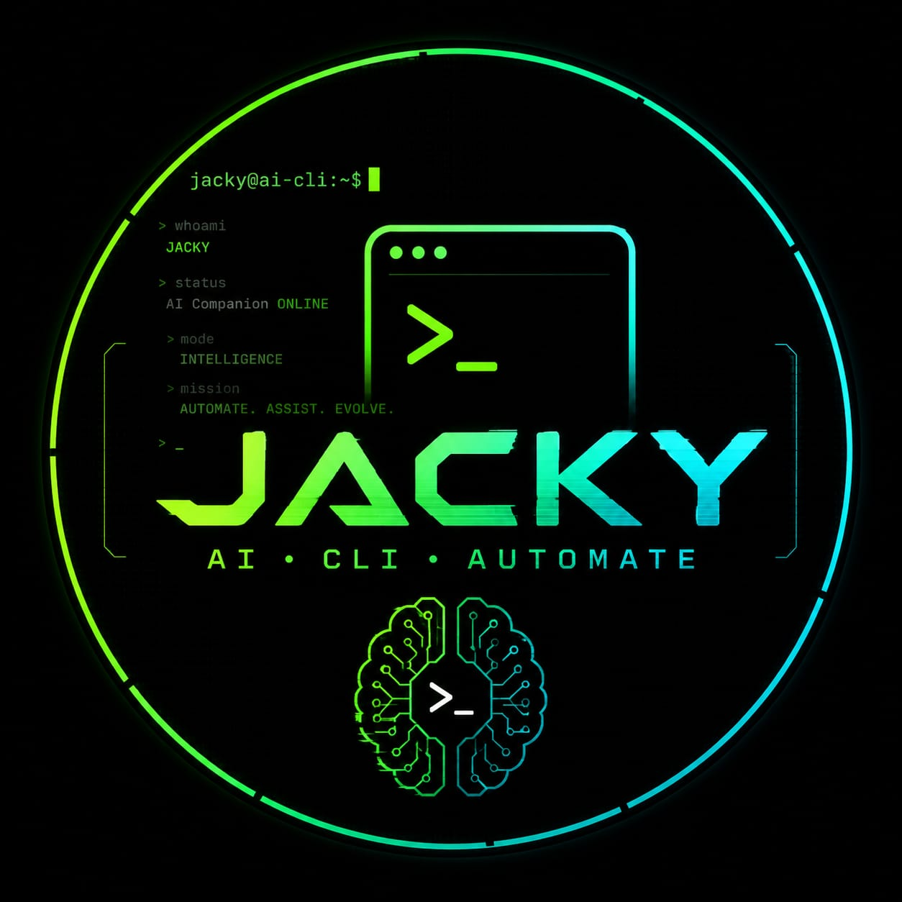

<p align="center">
  
</p>


<h1 align="center">Jacky CLI</h1>
<p align="center"><i>AI CLI, Automate.</i></p>

<p align="center">
  
</p>

<p align="center">
  <a href="https://github.com/jaswanthsai1/jacky-cli/blob/main/LICENSE"></a>
  <a href="https://github.com/jaswanthsai1"></a>
  <a href="https://github.com/NousResearch/hermes-agent"></a>
  
  
</p>
<p align="center">
  <a href="docs/translations/README.zh-CN.md"></a>
  <a href="docs/translations/README.ur-pk.md"></a>
  <a href="docs/translations/README.es.md"></a>
</p>

**Designer / Author:** [Maturi Jaswanth Sai Madhu Mohan](https://github.com/jaswanthsai1)

**Built on Hermes Agent by [Nous Research](https://nousresearch.com).** Jacky CLI
is a personalized, distinct distribution of Nous Research's MIT-licensed
[Hermes Agent](https://github.com/NousResearch/hermes-agent) — full credit and
thanks to the Nous Research team for the original agent, its tool-calling
architecture, and its self-improving skill system. This fork keeps that
foundation and adds: a bundled offensive-security / bug-bounty hunt-loop
methodology (`skills/`, `METHODOLOGY.md`), a one-command `setup.sh` bootstrap,
and CLI ergonomics tuned around dual local + cloud model use. If you're
looking for the upstream project, it's at
[github.com/NousResearch/hermes-agent](https://github.com/NousResearch/hermes-agent).


## Quick Start

```bash
git clone https://github.com/jaswanthsai1/jacky-cli.git
cd jacky-cli
./setup.sh
jacky
```

`setup.sh` creates a virtual environment, installs Jacky CLI into it, copies
`.env.example` → `.env`, links the `jacky` command onto your `PATH`, and — before
declaring success — actually runs `jacky --help` to prove the install works.

**Windows (native, PowerShell):**

```powershell
git clone https://github.com/jaswanthsai1/jacky-cli.git
cd jacky-cli
powershell -ExecutionPolicy ByPass -File scripts\install.ps1
```

See [`website/docs/user-guide/windows-native.md`](website/docs/user-guide/windows-native.md) for the native Windows feature matrix.

📖 **[Full documentation →](website/docs/)** &nbsp;|&nbsp; 🎯 **[Hunt-loop methodology →](docs/METHODOLOGY.md)**


## What Jacky can do

<table>
<tr><td><b>Dual local + cloud model support</b></td><td>Run entirely offline against <a href="https://ollama.com">Ollama</a> and any GGUF model — zero API cost, nothing leaves your machine — or point it at any OpenAI-compatible cloud provider (OpenRouter, direct OpenAI/Anthropic, Google AI Studio, and more). Switch providers any time with <code>jacky model</code>, no code changes.</td></tr>
<tr><td><b>Bundled offensive-security methodology</b></td><td>Ships with a real bug-bounty / red-team hunt-loop doctrine under <code>skills/</code>: scope → recon → rank → enumerate → test → validate → chain → report, plus finding-validation gates, evidence-hygiene discipline, and report-writing formulas. See <a href="docs/METHODOLOGY.md">METHODOLOGY.md</a>.</td></tr>
<tr><td><b>A closed learning loop</b></td><td>Agent-curated memory with periodic nudges. Autonomous skill creation after complex tasks — skills self-improve during use. FTS5 session search with LLM summarization for cross-session recall. Compatible with the <a href="https://agentskills.io">agentskills.io</a> open standard.</td></tr>
<tr><td><b>A real terminal interface</b></td><td>Full TUI with multiline editing, slash-command autocomplete, conversation history, interrupt-and-redirect, and streaming tool output.</td></tr>
<tr><td><b>Lives where you do</b></td><td>Telegram, Discord, Slack, WhatsApp, Signal, and CLI — all from a single gateway process. Voice memo transcription, cross-platform conversation continuity.</td></tr>
<tr><td><b>Scheduled automations</b></td><td>Built-in cron scheduler with delivery to any platform. Daily reports, nightly backups, weekly audits — all in natural language, running unattended.</td></tr>
<tr><td><b>Delegates and parallelizes</b></td><td>Spawn isolated subagents for parallel workstreams. Write Python scripts that call tools via RPC, collapsing multi-step pipelines into zero-context-cost turns.</td></tr>
<tr><td><b>Tool-calling and agentic by default</b></td><td>40+ built-in tools, an MCP client for connecting any MCP server, and a toolset system for scoping what's available per session.</td></tr>
<tr><td><b>Runs anywhere</b></td><td>Six terminal backends — local, Docker, SSH, Singularity, Modal, and Daytona. Daytona and Modal offer serverless persistence — your agent's environment hibernates when idle and wakes on demand.</td></tr>
</table>


## Local model (Ollama) vs. cloud provider setup

Jacky supports both, and switching between them is a one-line config change.

**Local, zero API cost, fully offline:**

```bash
curl -fsSL https://ollama.com/install.sh | sh   # install Ollama
ollama pull qwen3:8b                            # or any tool-calling-capable model
jacky model                                     # pick Ollama + the model you pulled
```

CPU-only works but is slower — see
[`website/docs/guides/local-ollama-setup.md`](website/docs/guides/local-ollama-setup.md)
for hardware guidance, model recommendations, and the timeout tuning needed
for slow CPU inference.

**Cloud, any OpenAI-compatible provider:**

```bash
cp .env.example .env   # done for you by setup.sh
# edit .env: add the API key for OpenRouter, OpenAI, Anthropic, Google AI
# Studio, z.ai, Kimi, MiniMax, Hugging Face, or your own OpenAI-compatible
# endpoint — see .env.example for the full list
jacky model            # pick your provider and model
```

Full provider reference: [`website/docs/integrations/providers.md`](website/docs/integrations/providers.md).


## Getting Started

```bash
jacky              # Interactive CLI — start a conversation
jacky model        # Choose your LLM provider and model
jacky tools        # Configure which tools are enabled
jacky config set   # Set individual config values
jacky gateway      # Start the messaging gateway (Telegram, Discord, etc.)
jacky setup        # Run the full setup wizard (configures everything at once)
jacky update       # Update to the latest version
jacky doctor       # Diagnose any issues
```

📖 **[Full documentation →](website/docs/)** &nbsp;|&nbsp; 🎯 **[Hunt-loop methodology →](docs/METHODOLOGY.md)**

---

## CLI vs Messaging Quick Reference

Jacky has two entry points: start the terminal UI with `jacky`, or run the gateway and talk to it from Telegram, Discord, Slack, WhatsApp, Signal, or Email. Once you're in a conversation, many slash commands are shared across both interfaces.

| Action                         | CLI                                           | Messaging platforms                                                              |
| ------------------------------ | --------------------------------------------- | -------------------------------------------------------------------------------- |
| Start chatting                 | `jacky`                                      | Run `jacky gateway setup` + `jacky gateway start`, then send the bot a message |
| Start fresh conversation       | `/new` or `/reset`                            | `/new` or `/reset`                                                               |
| Change model                   | `/model [provider:model]`                     | `/model [provider:model]`                                                        |
| Set a personality              | `/personality [name]`                         | `/personality [name]`                                                            |
| Retry or undo the last turn    | `/retry`, `/undo`                             | `/retry`, `/undo`                                                                |
| Compress context / check usage | `/compress`, `/usage`, `/insights [--days N]` | `/compress`, `/usage`, `/insights [days]`                                        |
| Browse skills                  | `/skills` or `/<skill-name>`                  | `/<skill-name>`                                                                  |
| Interrupt current work         | `Ctrl+C` or send a new message                | `/stop` or send a new message                                                    |
| Platform-specific status       | `/platforms`                                  | `/status`, `/sethome`                                                            |

For the full command lists, see [`website/docs/user-guide/cli.md`](website/docs/user-guide/cli.md) and [`website/docs/user-guide/messaging/`](website/docs/user-guide/messaging/).

---

## Documentation

Source docs live under [`website/docs/`](website/docs/):

| Section                                                                       | What's Covered                                             |
| ------------------------------------------------------------------------------ | ------------------------------------------------------------ |
| [Quickstart](website/docs/getting-started/quickstart.md)                       | Install → setup → first conversation in 2 minutes          |
| [CLI Usage](website/docs/user-guide/cli.md)                                    | Commands, keybindings, personalities, sessions             |
| [Configuration](website/docs/user-guide/configuration.md)                      | Config file, providers, models, all options                |
| [Messaging Gateway](website/docs/user-guide/messaging/)                      | Telegram, Discord, Slack, WhatsApp, Signal, Home Assistant |
| [Security](website/docs/user-guide/security.md)                                | Command approval, DM pairing, container isolation          |
| [Tools & Toolsets](website/docs/user-guide/features/tools.md)                  | 40+ tools, toolset system, terminal backends               |
| [Skills System](website/docs/user-guide/features/skills.md)                    | Procedural memory, Skills Hub, creating skills             |
| [Memory](website/docs/user-guide/features/memory.md)                           | Persistent memory, user profiles, best practices           |
| [MCP Integration](website/docs/user-guide/features/mcp.md)                     | Connect any MCP server for extended capabilities           |
| [Cron Scheduling](website/docs/user-guide/features/cron.md)                    | Scheduled tasks with platform delivery                     |
| [Providers](website/docs/integrations/providers.md)                            | Local (Ollama) and cloud (OpenAI-compatible) providers      |
| [Local Ollama Setup](website/docs/guides/local-ollama-setup.md)                | Zero-API-cost local setup, hardware guidance                |
| [Architecture](website/docs/developer-guide/architecture.md)                   | Project structure, agent loop, key classes                 |
| [Contributing](.github/CONTRIBUTING.md)                                                | Development setup, PR process, code style                  |
| [CLI Reference](website/docs/reference/cli-commands.md)                        | All commands and flags                                     |
| [Environment Variables](website/docs/reference/environment-variables.md)       | Complete env var reference                                  |
| **[Hunt-Loop Methodology](docs/METHODOLOGY.md)**                                    | **Bundled bug-bounty/offensive-security doctrine and skills** |

---

## Contributing

We welcome contributions! See [CONTRIBUTING.md](.github/CONTRIBUTING.md) for development setup, code style, and PR process.

```bash
git clone https://github.com/jaswanthsai1/jacky-cli.git
cd jacky-cli
./setup.sh
.venv/bin/pip install -e ".[all,dev]"
scripts/run_tests.sh
```

---

## Community

- 🐛 [Issues](https://github.com/jaswanthsai1/jacky-cli/issues)
- 📚 [Skills Hub (agentskills.io)](https://agentskills.io)
- 🔌 [computer-use-linux](https://github.com/avifenesh/computer-use-linux) — Linux desktop-control MCP server for Jacky and other MCP hosts, with AT-SPI accessibility trees, Wayland/X11 input, screenshots, and compositor window targeting.


## License

MIT — see [LICENSE](LICENSE).

Jacky CLI is a fork of [Hermes Agent](https://github.com/NousResearch/hermes-agent),
© Nous Research, used and modified under the MIT License. Jacky-specific
additions © Maturi Jaswanth Sai Madhu Mohan. See [LICENSE](LICENSE) for the
full dual attribution.


